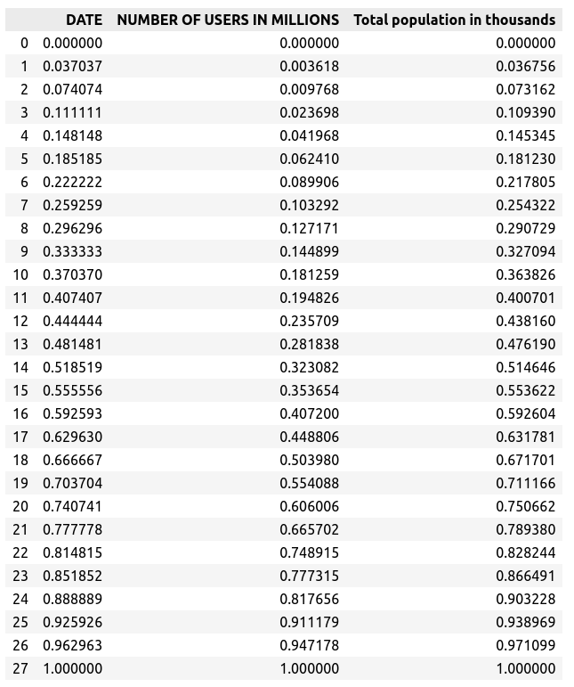

# Assignment 04

To complete this assignment, you may use the Jupyter notebook
from TensorFlow tutorial that describe a tutorial to handle
time series dataset. You can read it in [here](./tensorflow-time-series/time-series-forecasting.ipynb).
You may also need to use our notebook in Week-14 in [here](../week-14.ipynb). 
The datasets that we used to complete this assignment are 
[`fixed_form_internet-user.csv`](../datasets/fixed_form_internet-users.csv) and
[`fixed_form_population.csv`](../datasets/fixed_form_population.csv). 
Perform pre-processing to those datasets such that it is ready
for training with a deep learning model.

You do not need to build the deep learning model. Your task
is enough by doing data preparation. As a reminder, the 
number of items in those datasets are pretty small. 

To finish this assignment, you have to submit the Jupyter notebook
file that contains your answers. You can also add 
markdown, but it is optional.

The following are the stey-by-step to do `Assignment-04`.

1. Read carefully [`fixed_form_internet-user.csv`](../datasets/fixed_form_internet-users.csv) and 
   [`fixed_form_population`](../datasets/fixed_form_population.csv) 
   such that you can get a `DataFrame` object as the following
   .  
   You can use `pandas` to do this step.

   1. In `fixed_form_internet-user.csv`, we have `DATE` column which 
   consists of month and year, take the data for the last month 
   in that year. This can be December or another month before December.
   2. In `fixed_form_population.csv`, we have `Year` column which 
   will be used in `JOIN` operation (remember your 
   Database course) along with `DATE` column where you have taken its  
   year from the step (a). 
   Data rows that you get after `JOIN` operation, are only the rows
   that has an intersection among those two columns.
   3. If you have any trouble doing this `JOIN` operation, you can 
   perfom `JOIN` operation manually using Excel.

2. Make a plot from two columns **NUMBER OF USERS IN MILLIONS** 
   and **Total population in thousands**.
   

   [Hint]
   1. Remember that unit scale (_tciks_) for the $x$-axis have the same
      unit interval in both plots.
   2. The unit scale for the $y$-axis is _millions_ for both plots.

3. There are 29 rows in total for the given dataset. Use all of them 
   as a training set. For the validation and testing set, create an  
   empty `DataFrame` with (`pd.DataFrame()`). After that, perform 
   _scaling_ using `MinMaxScaler` function (see [_notebook_](../week-13.ipynb) in week-13). 
   You need to scale three columns: `DATE`, `NUMBER OF USERS IN MILLIONS` 
   and `Total population in thousands`.
   If you perform the previous steps and this step correctly, you 
   will get `DataFrame` like this
   
   
   
4. Using `DataWindow()` class from _notebook_ week-14 or 
   Python script `DataWindow.py`, make windowed dataset
   with input width 5 (five years), label width 2 (two years), 
   and _shift_ 2. This _shift_ is the 
   distace between the first label the last input (how far 
   you shift the label from the input).

   Name that windowed dataset with `window_data`. 
   If the above step is done correctly, you will get the following 
   print out of variable `window_data` like the following
   

   And also check `window_data`, with the following comand
   ```py
   window_data.plot(plot_col="NUMBER OF USERS IN MILLIONS", figsize=(12, 10), 
                     max_subplots=3, xlabel="Time (year)")
   ```
   and you will be expected to get this result:
   

   The above three plots for each run will give different plot
   because each plot is a sampling process randomly from the 
   windowed data. The thing that is needed to check is the size
   of the windowed data is the same as the parameter that you 
   use when creating `window_data`.
