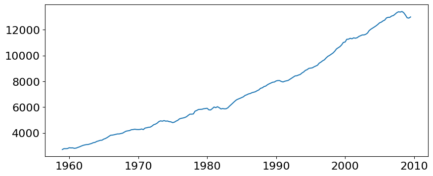
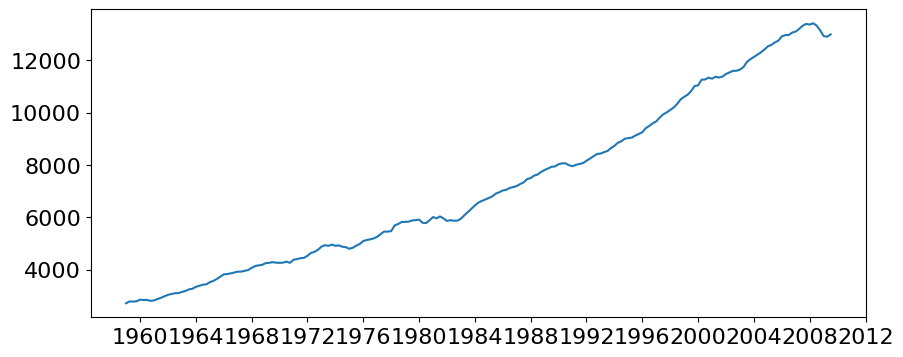
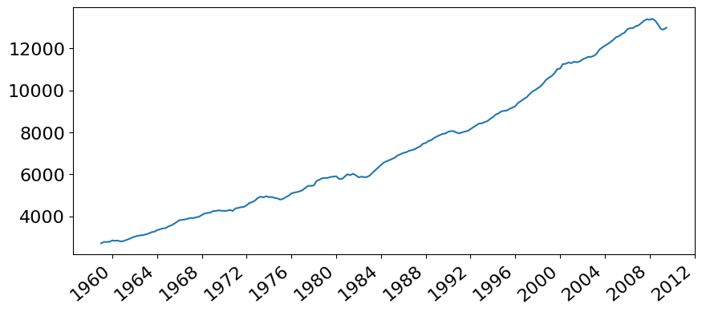
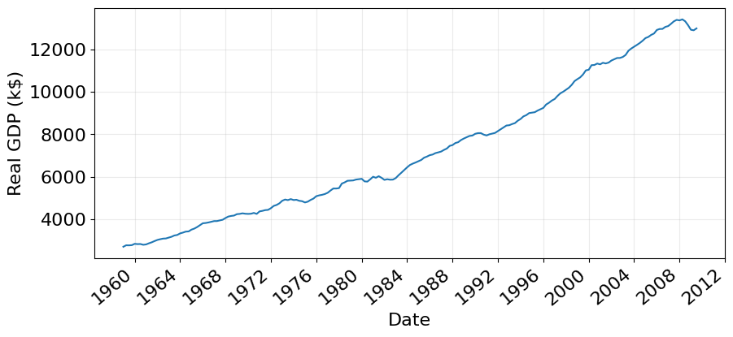
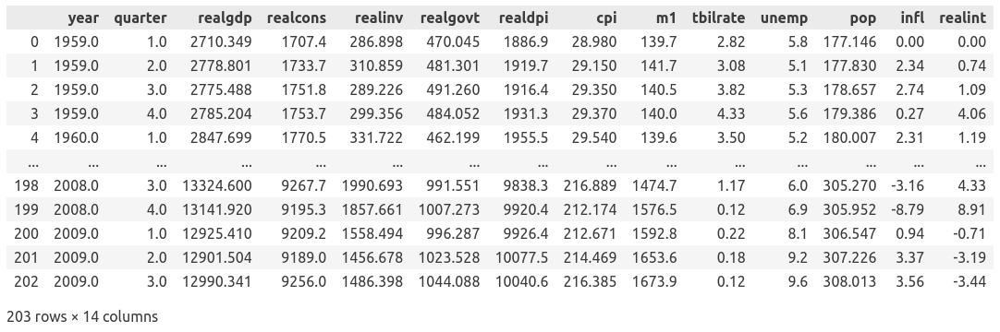
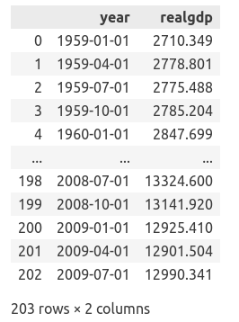
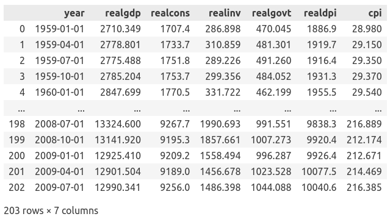
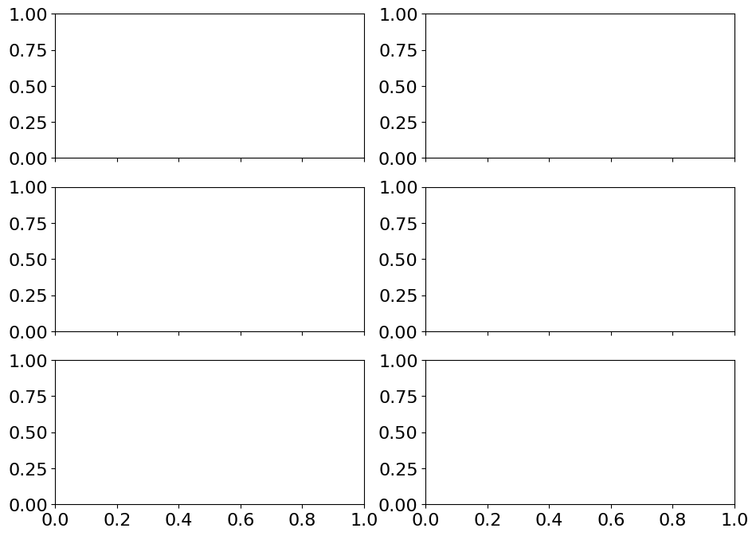
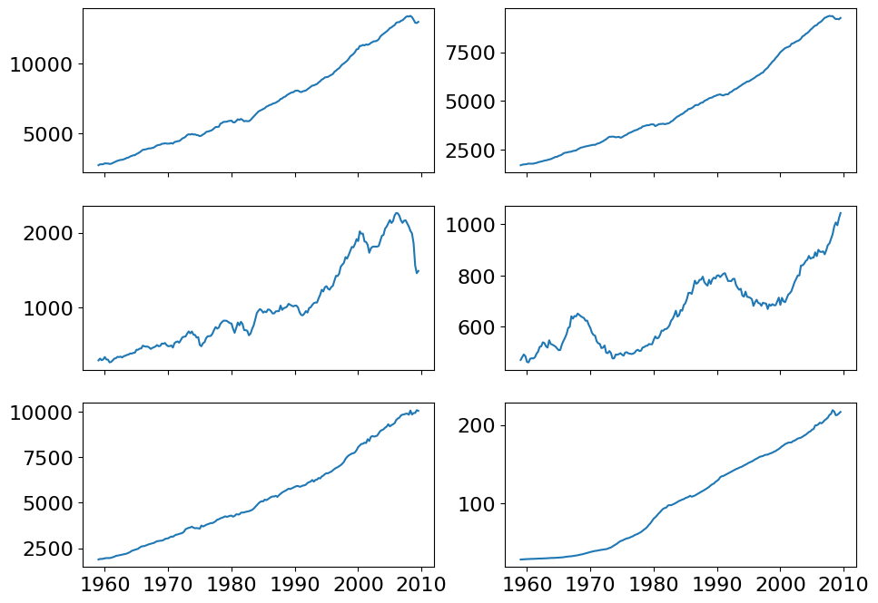
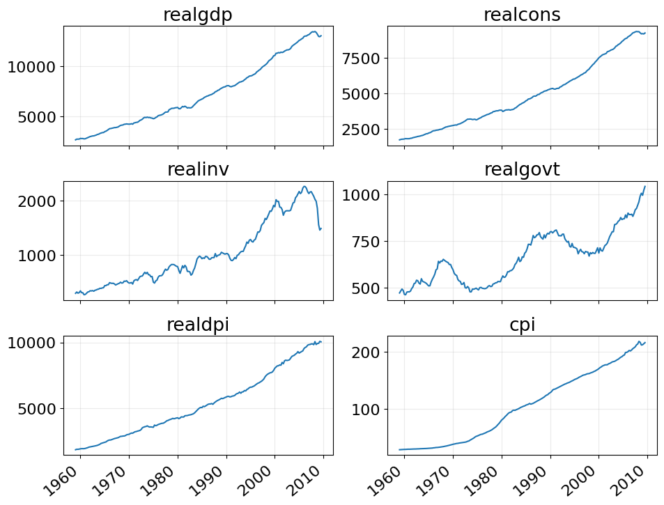

# Program description

In here we will show how to understand the program by describe for each line
and how to construct the full program. For that purpose, we use notebook
from `week-10.ipynb`. We also limit our description only to the technical 
part how the code are built. For the complete description for the forecasting
procedure, you have to read the notebook `week-10.ipynb`.

## Library that we used in week 10
```py
import numpy as np     
import matplotlib.pyplot as plt  # for plotting
import matplotlib.dates as mdates
import matplotlib as mpl
import pandas as pd     # table manipulation (DataFrame)
import itertools as itertls    # combinatorial
import statsmodels.api as sm_api    # statistics model that we used in our lecture

from tqdm import notebook
from typing import Union

from statsmodels.stats.diagnostic import acorr_ljungbox
from statsmodels.tsa.stattools import adfuller
from statsmodels.tsa.statespace.sarimax import SARIMAX

# To evaluate our model: MSE, MAE, MAPE
from sklearn.metrics import mean_squared_error, mean_absolute_error, \
                            mean_absolute_percentage_error
```

- `numpy`: providing an array manipulation (addition, multiplication, 
            transformation, etc.)
- `matplotlib`: very useful for ploting time series and data visualization 
                before and after model selection.
- `pandas`: data analysis library that provides us with a data type `DataFrame` 
            that is close to table format and easy to do manipulation
- `itertools`: built-in Python library (you do not need to install via `pip`). 
               This library provides us with a function to generate combination
               for given lists and setting.
- `statsmodels`: Python library that provides us with many statistical models
                 and testing. Without this library we have to write everything
                 from the scratch. This library is main library that we 
                 extensively use for all weeks.
- `tqdm`: To track the looping progress with progress bar. 
- `typing`: To give a type hint for the input argument(s) of a function
- `sklearn`: This library is a huge library that provides us with many
  machine learning models (non deep learning models). But here we use it
  to provide us with a function to evaluate our models


## Formatting figure output
This format is not necessary, but it helps us to get a better (a bigger size)
of our plot
```py
plt.rcParams.update(plt.rcParamsDefault)
plt.rcParams.update({
  "font.size": 16,
  "grid.alpha": 0.25})
```

The idea is it updates runtime configuration (`rc`) parameters for our plots.
First we load the default setting then we update two specific parameters:
`font.size` and `grid.alpha`. The first parameter is obviously to change
the font size of the plot. The second paramter is to set the level of 
transparency of grid lines.

## Function declaration to plot time series 
This description is for function `plot_time_series()`. We will start by 
build step-by-step until we have a complete program

Let us start from the raw structures of the function that contains only its
input. Remember because it will plot a figure, we do not need to return anything.  
In the future, I will include the `ax` output such that it can be used to set
the figure after calling the function

```py
def plot_time_series(x, y, xlabel="Time", ylabel="Value", figsize=(10, 4), 
                     use_date_locator=True, title=None, add_mark_at=None):
```

The description for each input arguments (positional and keyword arguments):
- `x`: a positional argument that stores a data along x-axis or that
  contains `datetime` data type. This input has a type of an array with
  size `N`. This size must be the same as the size of input `y`.
- `y`: a positional argument that stores a data along y-axis or that
  contains the value of time series that is under our study. 
  This input has a type of an array with
  size `N`. This size must be the same as the size of input `y`.
- `xlabel`: a keyword argument with string data type to set the x-axis label.
  The default value is `"Time"`.
- `ylabel`: a keyword argument with string data type to set the x-axis label.
  The default value is `"Value"`.
- `figsize`: a keyword argument with tuple or list data type to set the size
  of the figure. The default value is `(10, 4)`.
- `use_date_locater`: a keyword argument with boolean data type. 
  This argument is to set if we want to use specific format and location 
  foru our ticks of x-axis. We will explain it later. The default value is 
  `True`.
- `title`: a keyword argument with string data type to set the title of the 
  figure. The default value is `None`.
- `add_mark_at`: a keyword arugment with tuple or list data type with size 2.
  This argument specific for showing that the time series has seasonal 
  pattern. The first element of this argument is to set the location of mark
  at specific unit of time and the second element is to set how long
  the interval to plot the next mark. For example, if we have a seasonal
  pattern with a cycle of a year and unit date of month, we can set 
  `add_mark_at=(6, 12)`. This means that we will plot a mark at the month of
  June and with interval of 12 months for the next mark. We use this argument
  in week 9, but not in week 10. The default value is `None`.

The next step is to declare matplotlib figure and axis objects and plot
the time series. We also add `plt.show(fig)` to show our figure.

```py
def plot_time_series(x, y, xlabel="Time", ylabel="Value", figsize=(10, 4), 
                     use_date_locator=True, title=None, add_mark_at=None):
  fig, ax = plt.subplots(figsize=figsize)

  ax.plot(x, y)

  plt.show(fig)
```

If we test with the `df_gdp` like in the following cell:
```py
plot_time_series(df_gdp["year"], df_gdp["realgdp"],
                 xlabel="Date", ylabel="Real GDP (k$)")
```
we have the following output:


The plot is showed without enough description just a plain plot.

Next we add a setting for date time locator and formatter in x-axis.

```py
def plot_time_series(x, y, xlabel="Time", ylabel="Value", figsize=(10, 4), 
                     use_date_locator=True, title=None, add_mark_at=None):
  fig, ax = plt.subplots(figsize=figsize)
  ax.plot(x, y)

  if use_date_locator:
    formatter = mdates.DateFormatter("%Y")
    # formatter = mdates.DateFormatter("%Y-%b")
    locator = mdates.YearLocator(base=4)
    # locator = mdates.MonthLocator(bymonthday=1, bymonth=range(1, 13, 2))
    ax.xaxis.set_major_formatter(formatter)
    ax.xaxis.set_major_locator(locator)
```

Inside `if` block, we define two variables: `formatter` and `locator`.
`formatter` variable is used to set the format that will be showed in the plot.
Here we set the format `"%Y"`. This is corresponding to the four digits year
format. For the `locator`, we plot with the step after 4 months one to another.
This can be done by setting `base=4` in `mdates.YearLocator()`.
The last two rows are to add those two variables `formatter` and `locator`.

If we rerun this update of `plot_time_series()` function with `use_date_locator`
we have


The outplot plot has a bad visual in x-axis which is the tick labels are 
overlapping each other. To avoid that, we can rotate the tick labels with 
the following codes (which has been written in the full code)

```py
def plot_time_series(x, y, xlabel="Time", ylabel="Value", figsize=(10, 4), 
                     use_date_locator=True, title=None, add_mark_at=None):
  # some codes are omitted

  if use_date_locator:
    for j, label in enumerate(ax.get_xticklabels()):
      label.set_rotation(40)
      label.set_horizontalalignment('right')
```

This `if` block will iterate for each tick labels in x-axis and do
counterclockwise rotation of 40 degrees and set the tick label alignment
to the right (the end of tick label text will be positioned of its right end)

Now, we have plot after updating this tick label rotation and alignment


The next part is adding a procedure for `add_mark_at` 
```py
def plot_time_series(x, y, xlabel="Time", ylabel="Value", figsize=(10, 4), 
                     use_date_locator=True, title=None, add_mark_at=None):
  # some codes are omitted
  if add_mark_at:
    x_loc, cycle_length = add_mark_at
    ax.plot(x[x_loc::cycle_length], y[x_loc::cycle_length], linestyle="None",
      marker='o', markerfacecolor='w', markeredgewidth=2, 
      markeredgecolor="tab:blue")
```
In those codes, inside `if` block, we unpack the `add_mark_at` values into
two variables `x_loc` and `cycle_length`. We use these two variables
as the start and step index in our `x` and `y` arrays.
We won't use this block because we do not have any seasonality 
(see `week-09.ipynb` for the example)

The last step is add grid, labels and title.

```py
def plot_time_series(x, y, xlabel="Time", ylabel="Value", figsize=(10, 4), 
                     use_date_locator=True, title=None, add_mark_at=None):
  # some codes are omitted
  ax.grid("on")
  ax.set_xlabel(xlabel)
  ax.set_ylabel(ylabel)

  if title is not None:
    ax.set_title(title)
```

Finally we have the full code for `plot_time_series()`
```py
def plot_time_series(x, y, xlabel="Time", ylabel="Value", figsize=(10, 4), 
                     use_date_locator=True, title=None, add_mark_at=None):
  fig, ax = plt.subplots(figsize=figsize)

  ax.plot(x, y)

  if use_date_locator:
    formatter = mdates.DateFormatter("%Y")
    # formatter = mdates.DateFormatter("%Y-%b")
    locator = mdates.YearLocator(base=4)
    # locator = mdates.MonthLocator(bymonthday=1, bymonth=range(1, 13, 2))
    ax.xaxis.set_major_formatter(formatter)
    ax.xaxis.set_major_locator(locator)
  
  if add_mark_at:
    x_loc, cycle_length = add_mark_at
    ax.plot(x[x_loc::cycle_length], y[x_loc::cycle_length], linestyle="None",
      marker='o', markerfacecolor='w', markeredgewidth=2, 
      markeredgecolor="tab:blue")

  ax.grid("on")
  ax.set_xlabel(xlabel)
  ax.set_ylabel(ylabel)

  if title is not None:
    ax.set_title(title)

  if use_date_locator:
    for j, label in enumerate(ax.get_xticklabels()):
      label.set_rotation(40)
      label.set_horizontalalignment('right')

  plt.show(fig)
```

and the plot for `df_gdp`


## Load the time series data from `statsmodels.api`

In this notebook, we use built-in data that is provided by the library
`statsmodels`. We have already accessed when calling the library
```py
import statsmodels.api as sm_api
```
in the previous description.

With the following codes, we load the US macroeconomic data and use pandas
format object.
```py
macro_econ_data = sm_api.datasets.macrodata.load_pandas().data
macro_econ_data
```

And the notebook will show our data


### Select the specific columns in `macro_econ_data`
We select columns `year`, `quarter`, and `realgdp`. But there is a problem
that we need the format for the date time "YYYY-MM-DD". To transform into
that format, we have to do some tricks with Python code.

First, we have to collect the pair of data from the column `year` and `quarter`.
Using list comprehension we collect them into a list of two elements.
We also transform the data (`y` and `q`) which is a string into an integer
```py
[[int(y), int(q)] for y, q in zip(
  macro_econ_data['year'], 
  macro_econ_data['quarter'])]
```

We assume that collection of the data for each quarter started from 
January, April, July, and October. We also assume that the day when the data
is collected is at the first day of the month. Using this assumption we can 
update the code above
```py
[f"{int(y)}-{3*(int(q)-1) + 1:02d}-01"] for y, q in zip(
  macro_econ_data['year'], 
  macro_econ_data['quarter'])]
```
We use f-string formatter in the above string, and transform the quarter
1, 2, 3, 4 into their corresponding months by the formula `3*(int(q)-1) + 1`
and we use two digit format and with zero padding in the month as it is
written with the formatter `:02d`. All the year, month, and day are 
concatenated by '-' (hypen) to get the format date time "YYYY-MM-DD"

```py
[f"{int(y)}-{int(3*(q-1) + 1):02d}-01" for y, q in zip(
  macro_econ_data['year'],
  macro_econ_data['quarter'])]
```

We have transformed columns `year` and `quarter` to the date time string.
Then we collect that result, transform the date time string to pandas
datetime format and gather with `realgdp` column. The following codes
are the implementation
```py
df_gdp = pd.DataFrame({"year": 
  pd.to_datetime([f"{int(y)}-{int(3*(q-1) + 1):02d}-01" for y, q in zip(
    macro_econ_data['year'],
    macro_econ_data['quarter']
  )]),
  "realgdp": macro_econ_data["realgdp"]})
df_gdp
```
There will be two columns `year` with format "YYYY-MM-DD" and `realgdp` 
in the DataFrame `df_gdp`  



### Select target and exogenous variables in `macro_econ_data` 
For the demonstration of SARIMAX model, we use `realgdp` column as the 
target variable, the variable that we want to forecast, and
five exogenous variables: `realcons`, `realinv`, `realgovt`, `realdpi`, 
`realdpi`, and `cpi`. These exogenous variables are assumed that influence
our target variables. The following codes are creating a new variable
`selected_macro_econ_data`
```py
selected_macro_econ_data = df_gdp.copy()
selected_macro_econ_data["realcons"] = macro_econ_data["realcons"].copy()
selected_macro_econ_data["realinv"] = macro_econ_data["realinv"].copy()
selected_macro_econ_data["realgovt"] = macro_econ_data["realgovt"].copy()
selected_macro_econ_data["realdpi"] = macro_econ_data["realdpi"].copy()
selected_macro_econ_data["cpi"] = macro_econ_data["cpi"].copy()

selected_macro_econ_data
```

In the first row, we copy from `df_gdp` because we do not want to recreate
the column `year`. After that we add one by one the columns for exogenous 
variables. We have the result for `selected_macro_econ_data`  


## Plot DataFrame `selected_macro_econ_data` (3x2 subplots)

Now we visualize the all variables in `selected_macro_econ_data`.
First we create figure and axes object from matplotlib.
We set the number of columns and rows to be `nrows=3` and `ncols=2` respectively 
because we want to create 3x2 subplots. There is an additional keyword 
argument `sharex=True` that controls the tick positions and unit scale
of x-axis for the subplots which has the same columns position. 
At the end, we call `plt.show(fig)` to show our figure

```py
fig, axes = plt.subplots(nrows=3, ncols=2, figsize=(11, 8), sharex=True)

plt.show(fig)
```

Then we have the following subplots  


As we can see that it creates 3x2 subplots, but we haven't put any data
to them yet. To make it easier to do indexing in the axes object, we
do `.flatten()` to our `axes` object. This will make the shape of `axes` object 
transform from 3 by 2 into a list with 6 elements of axes. 
With `zip()`, we also do a pairing
between axes object and column's name of `selected_macro_econ_data`.
In the below is the update to the 3x2 subplots
```py
fig, axes = plt.subplots(nrows=3, ncols=2, figsize=(11, 8), sharex=True)

for (i, ax), col_name in zip(enumerate(axes.flatten()), ["realgdp", "realcons", "realinv", "realgovt", "realdpi", "cpi"]):
  ax.plot(selected_macro_econ_data["year"], selected_macro_econ_data[col_name])

plt.show(fig)
```
and we have the result   


The last step is just for the sake of visualization appealing that we have to
show the grid, add title, x-axis tick labels rotation to avoid overlapping
and the spacing between subplots that are controlled by the 
arguments `hspace` and `wspace` in `plt.subplots_adjust()`.

The complete codes are
```py
fig, axes = plt.subplots(nrows=3, ncols=2, figsize=(11, 8), sharex=True)

for (i, ax), col_name in zip(enumerate(axes.flatten()), ["realgdp", "realcons", "realinv", "realgovt", "realdpi", "cpi"]):
  ax.plot(selected_macro_econ_data["year"], selected_macro_econ_data[col_name])
  ax.set_title(col_name)
  ax.grid("on")

  if col_name in ["realdpi", "cpi"]:
    for j, label in enumerate(ax.get_xticklabels()):
      label.set_rotation(40)
      label.set_horizontalalignment('right')

plt.subplots_adjust(hspace=0.3, wspace=0.2)
plt.show(fig)
```
and the final result of the 3x2 subplots is    


## Create two separate DataFrame for the target and exogenous variables
The following codes are to create a new DataFrame for our target variable
and exogenous variables
```py
target = selected_macro_econ_data[["year", "realgdp"]]
exogenous = selected_macro_econ_data[["year", "realcons", "realinv", "realgovt", "realdpi", "cpi"]]
```

## Test for the stationarity of the target variable

### ADF statistic for original time series
Using the library `statsmodels`, we have already imported a function
to calculate ADF statistic in 

```py
from statsmodels.tsa.stattools import adfuller
```

Now we calculate the ADF statistic of the `realgdp` time series.
We only need the first two results that contains the ADF statistic value
and its $p$-value.
```py
ADF_result = adfuller(target["realgdp"])
print(f"ADF statistic: {ADF_result[0]}")
print(F"p-value: {ADF_result[1]}")
```

### ADF statistic for the first-differencing time series

We continue to do ADF statistic again to the first-differencing of the
original time series, because the original time series is non-stationary.
In the first line, we transformed the original time series to its first-order
difference by using `np.diff()` with order of difference is set by `n=1`. 
All the rest rows are the same as previous calculation for the original
time series.
```py
target_diff = np.diff(target["realgdp"], n=1)
ADF_result = adfuller(target_diff)
print(f"ADF statistic: {ADF_result[0]}")
print(F"p-value: {ADF_result[1]}")
```


## The function declaration to find the optimal SARIMAX model

First, let us define the general structure of our function
```py
def optimize_SARIMAX(endog: Union[pd.Series, list], 
                    exog: Union[pd.Series, list],
                    order_list: list, d: int, 
                    D: int, m: int,
                    enforce_stationarity: bool=True, 
                    enforce_invertibility: bool=True) -> pd.DataFrame:

  result = []

  return result
```

The function `optimize_SARIMAX()` has the following input arguments:
- `endog`: a positional argument that receive an endogenous variable
  (target variable). The data type is pandas DataFrame series or list.
- `endog`: a positional argument that receive an exogenouus variables.
- `order_list`: a positional argument that has list data type. This input
  argument contains a given possible orders of $p$, $q$, $P$, and $Q$ in our 
  $\text{SARIMAX}(p, d, q)(P, D, Q)_m$ model.
- `d`: a positional argument that has integer data type to be set equal
  to the integrated order (the number of differencing) of the time series.
- `D`: a positional argument that has integer data type. This input argument
  is set to be equal to the seasonal integrated order (the number
  of seasonal differencing) of the time series
- `m`: a positional argument that has integer data type to be set equal to 
  the number of frequency in one season of the time series.
- `enforce_stationarity` and `enforce_invertibility`: two keyword arguments
  which has boolean data type. At this time, you do not need to set this.

The goal of our function is to get the list of $(p, q, P, Q)$ that
is sorted from the lowest AIC to the highest AIC.

Update the function above by adding iteration through all possible `order_list`. 
Because the calculation is time consumed, we add a feature to draw a progress
bar to track the calculation during the iteration.
```py
def optimize_SARIMAX(endog: Union[pd.Series, list], 
                    exog: Union[pd.Series, list],
                    order_list: list, d: int, 
                    D: int, m: int,
                    enforce_stationarity: bool=True, 
                    enforce_invertibility: bool=True) -> pd.DataFrame:

  result = []

  for order in notebook.tqdm(order_list):
    try:
      model = SARIMAX(endog, exog, order=(order[0], d, order[1]),   # we add exog
                      seasonal_order=(order[2], D, order[3], m), 
                      simple_differencing=False, 
                      enforce_invertibility=enforce_invertibility,
                      enforce_stationarity=enforce_stationarity).fit(disp=False)
    except:
      continue

    aic = model.aic
    result.append([order, aic])

  return result  
```

In the above codes, we add exception handling to catch any error during the
calculation of SARIMAX model. For each `order` $(p, q, P, Q)$ in `order_list`
is inputted to `SARIMAX()` to get the model.
AIC is calculated by `model.aic` and appended to `result` array.

Now we transformed the `result` array into pandas DataFrame and set 
column name `["(p,q,P,Q)", "AIC"]`. The last step is sorting the DataFrame
based on the column `AIC`. We also change the out from `return` to `return_df`.
Finally we have the complete code
```py
def optimize_SARIMAX(endog: Union[pd.Series, list], 
                    exog: Union[pd.Series, list],
                    order_list: list, d: int, 
                    D: int, m: int,
                    enforce_stationarity: bool=True, 
                    enforce_invertibility: bool=True) -> pd.DataFrame:

  result = []

  for order in notebook.tqdm(order_list):
    try:
      model = SARIMAX(endog, exog, order=(order[0], d, order[1]),   
                      seasonal_order=(order[2], D, order[3], m), 
                      simple_differencing=False, 
                      enforce_invertibility=enforce_invertibility,
                      enforce_stationarity=enforce_stationarity).fit(disp=False)
    except:
      continue

    aic = model.aic
    result.append([order, aic])


  result_df = pd.DataFrame(result)
  result_df.columns = ["(p,q,P,Q)", "AIC"]

  result_df = result_df.sort_values(by="AIC", ascending=True).reset_index(drop=True)

  return result_df
```


## Generate `order_list` in `optimize_SARIMAX()`

The following codes are the time when we use `itertools` library to generate
input argument `order_list`
```py
p_space = range(0, 4, 1)
q_space = range(0, 4, 1)
P_space = range(0, 4, 1)
Q_space = range(0, 4, 1)

d = 1
D = 0
m = 4          

sarimax_order_list = list(itertls.product(p_space, q_space, P_space, Q_space))
print(f"num. of possible paramters setting: {len(sarimax_order_list)}")
sarimax_order_list
```
The main code is in `list(itertls.product())` where we perform all the 
combination of four arrays `p_space`, `q_space`, `P_space`, and `Q_space`.

## Separate between train and test set of `target` and `exogenous`
We use `idx_split` to separate `target` and `exogenous` variables.
Because `target` and `exogenous` are pandas DataFrame, accesing its
subDataFrame should use `.iloc` (index location).
```py
idx_split = 196
target_train = target.iloc[:idx_split] 
exogenous_train = exogenous.iloc[:idx_split]

target_test = target.iloc[idx_split:]
exogenous_test = exogenous.iloc[idx_split:]
```

## Invoking `optimize_SARIMAX` and store the result
The following codes are called to find the best SARIMAX model based
on the lowest AIC. Because the calculation is quite long, we store the 
result after the calculation and put commment to make sure that we do not
run it again accidentally.
```py
sarimax_result_df = optimize_SARIMAX(target_train["realgdp"], 
    exogenous_train[["realcons", "realinv", "realgovt", "realdpi", "cpi"]], 
    sarimax_order_list, d, D, m, 
    enforce_invertibility=True, 
    enforce_stationarity=True)
```

Store the `sarimax_result_df` that contains AIC for given $(p,q,P,Q)$ order to
a csv file with name `ch-09-sarimax-realgdp-result.csv`. We also put a comment
to this code after runnning it once.
```py
sarimax_result_df.to_csv(
  "./results/ch-09-sarimax-realgdp-result.csv", 
  index=False)
```

If in the future, you reopen the notebook, you only need to reload all
the result from the previous calculation for finding the best model.
```py
reload_sarimax_result_df = pd.read_csv("./results/ch-09-sarimax-realgdp-result.csv")
```

## Reload the saved `order_list` and get the best order paramters
After reload the generated `order_list`, the following codes are used
to get the best order $(p, q, P, Q)$

```py
best_pqPQ = reload_sarimax_result_df["(p,q,P,Q)"].iloc[0]
best_sarimax_p, best_sarimax_q, best_sarimax_P, best_sarimax_Q \
  = tuple(map(int, best_pqPQ.strip("()").split(", ")))
print(f"best SARIMAX (p,d,q)(P,D,Q)_m: {(best_sarimax_p, d, best_sarimax_q)}" +\
  f"{(best_sarimax_P, D, best_sarimax_Q)}_{m}")
```

The best model is in the first index (number 0) of `reload_sarimax_result_df`.
Because the order is stored in string format with parenthesis, we need to strip
the parenthesis and split them by delimiter comma (`,`). Then we map
`int` function to each the split elements using `map()` function. The last
step is to convert the map object result to tuple.

## Fit the best model to the train set
After we have get the best SARIMAX model, we can apply the following codes
to get a model object that has been fitted to the data
```py
model_sarimax_best = SARIMAX(target_train["realgdp"], 
                              exogenous_train[["realcons", "realinv", "realgovt", "realdpi", "cpi"]], 
                              order=(best_sarimax_p, d, best_sarimax_q), 
                              seasonal_order=(best_sarimax_P, D, best_sarimax_Q, m), 
                              simple_differencing=False)
model_sarimax_best_fit = model_sarimax_best.fit(disp=False)
print(model_sarimax_best_fit.summary())
```

We set `simple_differencing=False` because we do not want to do differencing
to our time series.
The second line is to do fitting to our train set by invoking function `.fit()`
to the SARIMAX model object.

We can get a statistical overview of this SARIMAX model object by invoking 
function `.summary()`.


## Qualitative residual analysis 
To perform qualitative residual analysis with four type of plots: residual plot, 
histogram plot, Q-Q plot, and correlogram, we use the function `.plot_diagnostic()`.

For the sake of visualization, we set the y-axis limit of correlogram plot
to be as compact as possible.

```py
# qualitative test for the residual
fig = model_sarimax_best_fit.plot_diagnostics(figsize=(12, 10))

# get all axes
axs = fig.get_axes()
for ax in axs:
  ax.grid("on")

# set y-lim for correlogram plot
axs[3].set_ylim([-0.25, 1.1])
plt.show(fig)
```

## Quantitative residual analysis (Ljung-Box test)

Quantitiva residual analysis is performed by calling `acorr_ljungbox` with
the first argument is the residual (calculating from `model_sarimax_best_fit.resid`).
Second argument is set to the how many $p$-value of Ljung-Box test that
are corresponding to the number of lags that we want to calculate.
```py
residuals = model_sarimax_best_fit.resid
ljung_box_test = acorr_ljungbox(residuals, np.arange(1, 11))
ljung_box_test
```

## The function that forecasts the time series

I think this is the most difficult function that we have created so far 
(and also from the perspective of the students).
In this function, we do forecast many times because we cannot do a single
forecast with smaller `HORIZON` than the length of train set, 
except if `HORIZON = len(TRAIN_SET)`. The basic idea is to perform forecasting
up to `HORIZON`, and use train set and actual value up to `HORIZON` as a new 
train set do again forecasting. After several times doing this, we have
a full set prediction on train set. 

First, we declare the general structure of the function
```py

```