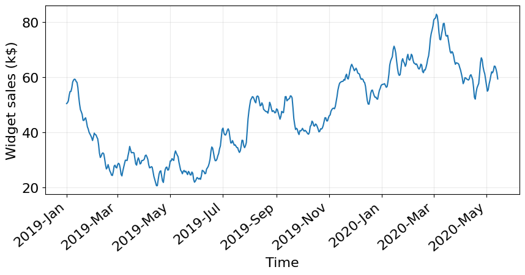
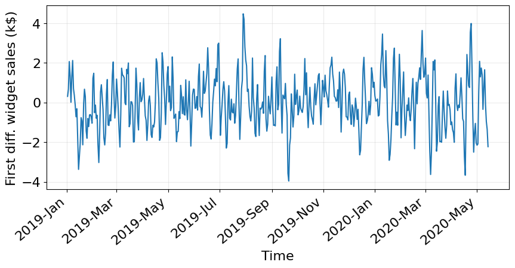
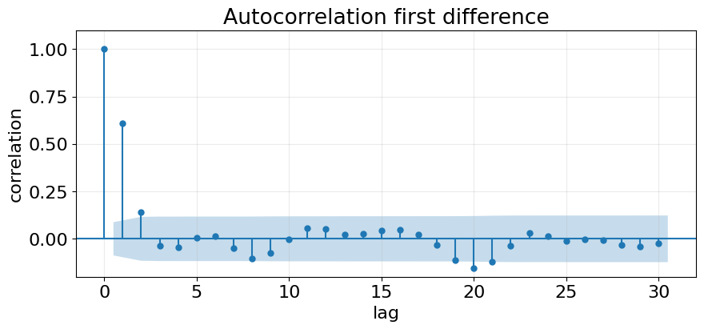
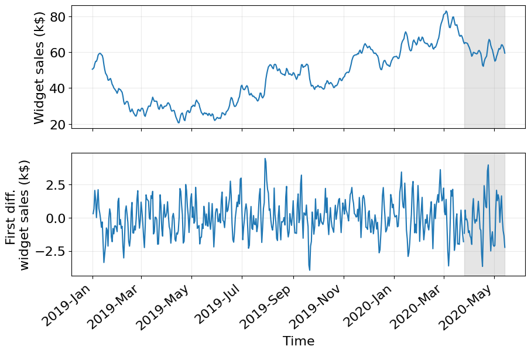
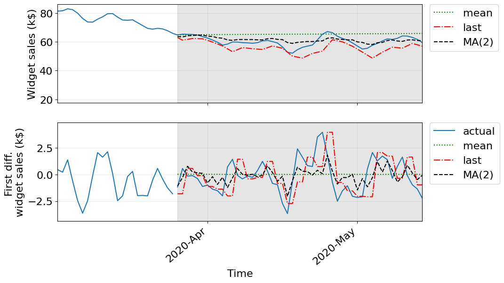
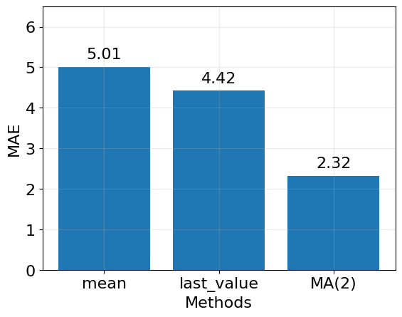

# Template Assignment

Nama: Nam lengkap    
NIM: Nomor_induk_mahasiswa

> **Catatan**  
> Silahkan gunakan bahasa dan tulisan kalian sendiri.
> Kalimat dan penjelasan berikut hanyalah contoh pengerjaan tugas.
> Usahakan menggunakan penjelasan yang saling berbeda antara satu
> mahasiswa dengan mahasiswa yang lain.

Pada tugas berikut kita akan melakukan peramalan data penjualan _widget_ suatu 
perusahaan XYZ yang dinyatakan dalam ribu dollar dari tanggal 
01 Januari 2019 sebanyak 500 hari kedepan. Berikut adalah grafik data tersebut



Disini terlihat kita bahwa grafik memiliki bentuk tidak stasioner
yaitu ada _trend_ turun dari bulan Januari 2019 hingga Maret 2019.
Lalu _trend_ naik dari Mei 2019 hingga Maret 2020. Secara kuantitatif
bentuk tidak stasioner ini dapat kita hitung dengan melakukan transformasi
ke _first difference_ yaitu _time series_, $y'_t = y_t - y_{t-1}$,
dengan $y_t$ adalah nilai penjualan saat waktu $t$ dan $y'_t$ adalah
_first difference_ dari $y_t$. Berikut adalah plot untuk _first difference_
penjualan _widget_ 



Pada plot di atas terlihat _first difference_ memiliki bentuk stasioner
yaitu bergerak secara fluktuatif disekitar 0. Kita dapat membandingkan
nilai ADF statistik dan $p$-value-nya dari kedua plot di atas:
- Plot asli ($y_t$):
  - ADF statistik: $-1.51$
  - $p$-value: $0.527$
- Plot _first difference_ ($y'_t$):
  - ADF statistik: $-10.58$
  - $p$-value: $7.077 \times 10^{-19} \approx 0$

Berdasarkan uji ADF statistik dengan acuan $p$-value di bawah $0.005$
menyatakan bahwa nilai ADF statistik untuk _first difference_ sangat
negatif dibanding data _time series_ asli yang memiliki $p$-value
masih di sekitaran $p$-value acuan. Sehingga dapat kita simpulkan
data _first difference_ bersifat stasioner menurut uji ADF statistik.

Dikarenakan data _first difference_ stasioner, kita dapat melakukan 
peramalan untuk data tersebut.
Untuk dapat menggunakan model _moving average_, kita perlu mengetahui
orde $q$ yaitu seberapa banyak data di waktu lampau yang berpengeruh 
terhadap data sekarang. Hal ini dapat kita peroleh dengan melakukan 
plot ACF (_**a**uto**c**orrelation **f**unction_) _first difference_ yang didapat sebagai berikut



Pada plot di atas terlihat untuk _lag_ di atas 2, lag 3 dan seterusnya,
nilai korelasi berada di dalam ambang batas-bawah (daerah yang diarsir).
Hal ini menunjukkan untuk _lag_ 3 dan seterusnya, autokorelasinya 
bisa diabaikan (mendekati nilai nol). Jadi hanya autokorelasi dengan
_lag_ 1 dan 2 yang memiliki pengaruh terhadap data _first difference_.
Sehingga kita dapatkan order $q$ untuk model _moving average_ adalah
nilai maksimum _lag_ yang masih berpengaruh (nilai autokorelasinya diatas
ambang batas-bawah atau tidak boleh kita abaikan), yaitu $q = 2$.

Sebelum melakukan peramalan, pertama-tama kita bagi data menjadi
dua bagian data `train` dan `test` dengan komposisi 90% untuk
data `train` dan 10% untuk data `test`.
Karena transformasi _first difference_, jumlah total data _first difference_
tidak tepat 500, melainkan berkurang satu karena kita tidak bisa
menghitung $y'_0$ sebab membutuh data di tanggl 31 Desember 2018.
Kita baru bisa menghitung data _first difference_ dimulai dari 02 Januari 2019.

Sehingga rincian data untuk 
- `train`: dari tanggal 02 Januari 2019 kedepan sebanyak 449 hari
- `test`: dari tanggal 26 Maret 2020 kedepan sebanyak 50 hari

Kita dapat melakukan plot untuk menandai 50 hari data `test` pada gambar
di bawah ini



Pada gambar di atas, daerah yang berwarna abu-abu adalah daerah untuk data `test` yang merupakan daerah yang akan kita lakukan peramalan.

Ingat bahwa proses peramalan hanya dilakukan dengan panjang data
2 hari. Jadi misal kita ingin memprediksi dua hari kedepan 
tanggal 02 dan 03 April 2020 kita menggunakan semua data dari tanggal
02 Januari 2019 hingga 01 April 2020. Perlu diperhatikan data dari tanggal
26 Maret 2020 hingga 01 April bukan menggunakan data hasil peramalan.
Peralaman semacam ini disebut `rolling forecast`.

> **Catatan**   
> Silahkan dicoba apa yang terjadi jika pada tanggal 26 Maret 2020 hingga
> 01 April kita menggunakan nilai hasil peramalan pada proses sebelumnya.

Berikut adalah hasil peramalan untuk tiga model yang dipilih: (a) model
rata-rata, (b) model nilai akhir, dan (c) model _moving average_ dengan orde
2, $\text{MA}(2)$.



Plot bagian atas adalah peramalan data asli dan plot bagian 
bawah adalah peralaman data _first difference_. Berikut penjelasan 
masing-masing model. Perlu diingat orde $q$ yang telah kita tentukan
dari plot ACF menentukan lebar _horizon_ atau seberapa lama kita
melakukan peramalan. Disini kita dapatkan $q=2$, berarti kita hanya
melakukan peramalan dua hari kedepan.

- **model rata-rata**:   
  Model ini dilakukan dengan cara mengambil rata-rata data di waktu sebelumnya.
  Misal kita ingin meramal nilai penjualan _widget_ di tanggal 26 dan 27
  Maret 2020, berarti kita akan mnggunakan data dari tanggal 02 Januari 2019
  hingga tanggal 25 Maret 2020, lalu dihitung rata-ratanya dan nilainya 
  digunakan untuk hasil ramalan di tanggal 26 dan 27 Maret 2020.
  Untuk tanggal 28 dan 29 Maret 2020, kita menggunakan data dari tanggal 
  02 Januari 2019 hingga 27 Maret 2020. 

  Karena perbedaan untuk tiap 2 hari prediksi sangat kecil, maka
  yang terlihat dari prediksi ini hanya berupa garis lurus mendatar
  (lihat garis titik-titik warna hijau). 

- **model nilai akhir**:   
  Model ini dilakukan dengan cara mengambil nilai akhir dari waktu sebelumnya. 
  Proses _rolling forecast_ sama seperti pada model rata-rata.

  Pada plot _first difference_ terlihat hasil ramalan berupa dua titik sejajar
  yang saling berurutan (garis titik warna merah).

- **model $\text{MA(2)}$**:    
  Model ini dihitung denga _library_ `statsmodels` dengan potongan 
  kode sebagai berikut (lihat minggu 04):
  ```py
  model = SARIMAX(df[:i]["widget_sales_diff"], order=(0, 0, 2))
  res = model.fit(disp=False)
  predictions = res.get_prediction(0, i + window - 1)
  oos_pred = predictions.predicted_mean.iloc[-window:]   # oos: output of sarimax
  ```

  Di baris pertama, kita memanggil model SARIMAX yaitu merupakan model 
  yang secara general mencakup model _moving average_ ("MA" di bagian SARIMAX).
  Disini kita atur `order=(0, 0, 2)`, yang berarti kita menggunakan model
  _moving average_ dengan orde 2, $\text{MA}(2)$. Pada baris ini terlihat
  kita menggunakan data dari 02 Januari 2019 hingga `i=`25 Maret 2020,
  Varibel `i` ini akan terus bergerak hingga 12 Mei 2020 (hari terakhir
  ketiga dari data data ke-500).

  Baris kedua dilakukan _fitting_ atau pengapliakasian model ke data.

  Baris ketiga dilakukan prediksi dengan lebar _horizon_ sebesar `window=2`.

  Baris keempat mengambil `window=2` hari terakhir hasil prediksi dari 
  objek `predictions`.

  Pada plot hasil ramalan, model ini diberikan sebagai garis warna hitam
  putus-putus.

Untuk dapat membandingkan manakah model yang memberikan hasil terbaik,
kita menggunakan metrik/ukuran MAE (Mean Absolute Error) yaitu seberapa jauh jarak hasil ramalan model dengan data asli lalu dibagi 50 (jumlah data `test`).

Berikut hasil MAE dalam bentuk histogram untuk data asli (bukan data
_first difference_)



Pada gambar histogram di atas terlihat model $\text{MA}(2)$ memberikan 
nilai metrik MAE lebih kecil dari semua model yang berarti bahwa
hasil ramalan sangat dekat dengan nilai sebenarnya yaitu sejauh
2.32 ribu dolar. Jika kita melihat lebih detil, penjualan pada bagian
data `test` selalu berada di atas 50 ribu dolar. Artinya terdapat
kesalahan hasil prediksi secara rata-rata di kisaran 4% 
(Kita bisa juga dengan cara lain mengetahui 4% ini dengan menghitung MAPE
dan tentunya lebih sesuai).

Dapat kita simpulkan bahwa telah dilakukan peramalan data penjualan
_widget_ perusahaan XYZ dengan tiga model: (a) model rata-rata, (b)
model nilai akhir, dan (c) model $\text{MA}(2)$.
Dari ketiga model tersebut, model _moving average_ memberikan hasil terbaik
dengan $\text{MAE} = 2.32$ yang berarti secara rata-rata tiap dua hari
sekali dilakukan peramalan, model _moving average_ memberikan selisih
hasil ramalan dengan hasil sebenarnya sebesar 2.32 ribu dolar.
